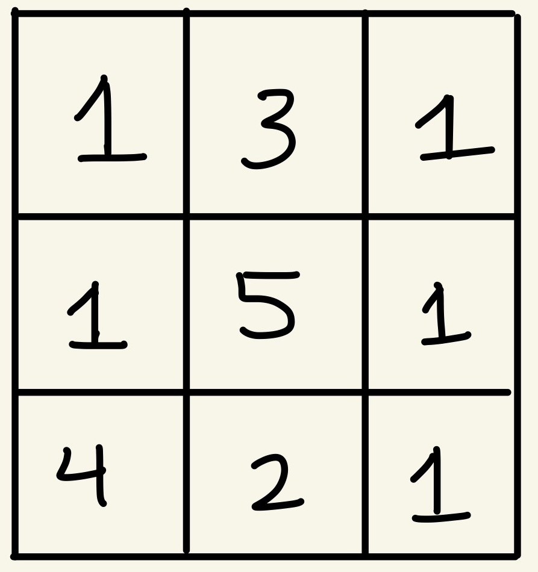
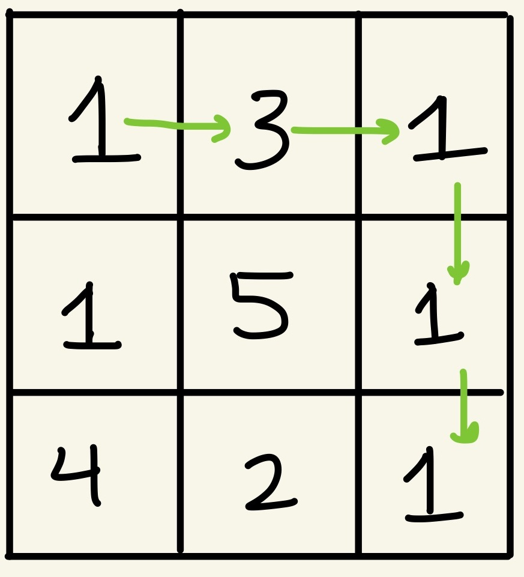
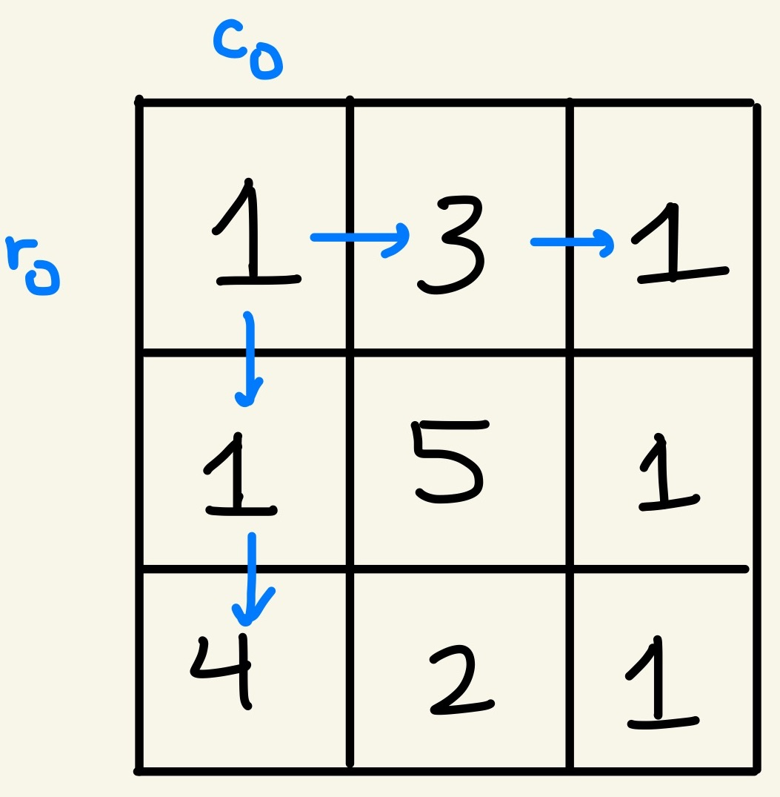
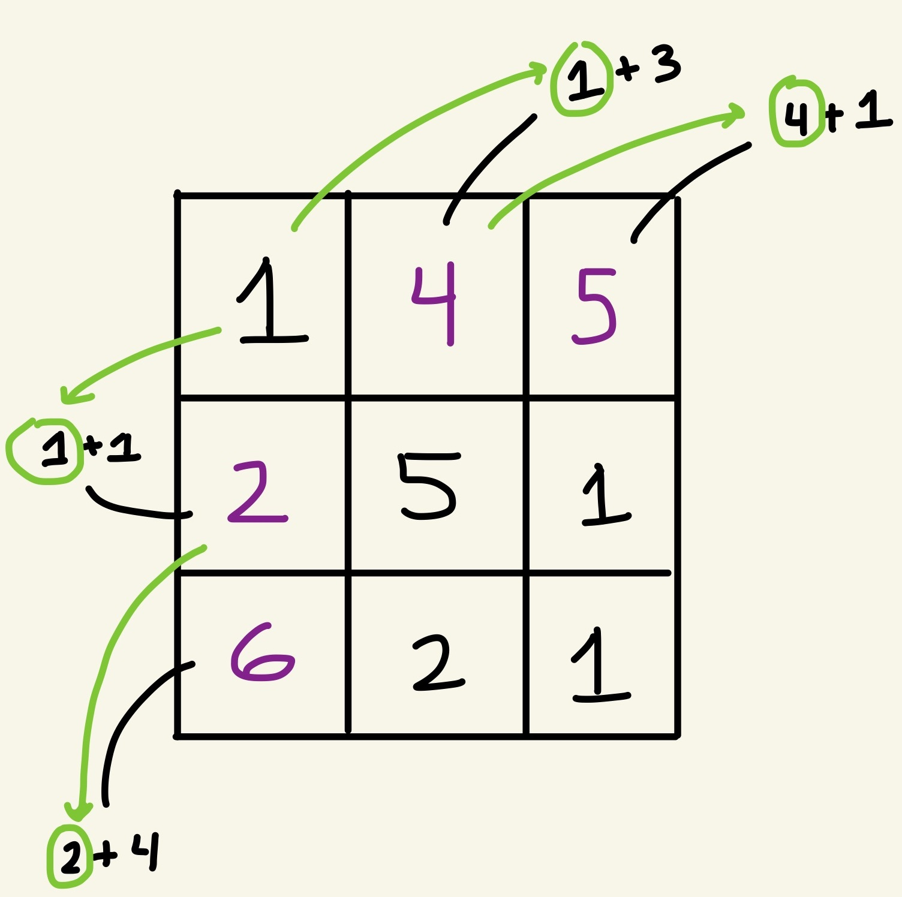
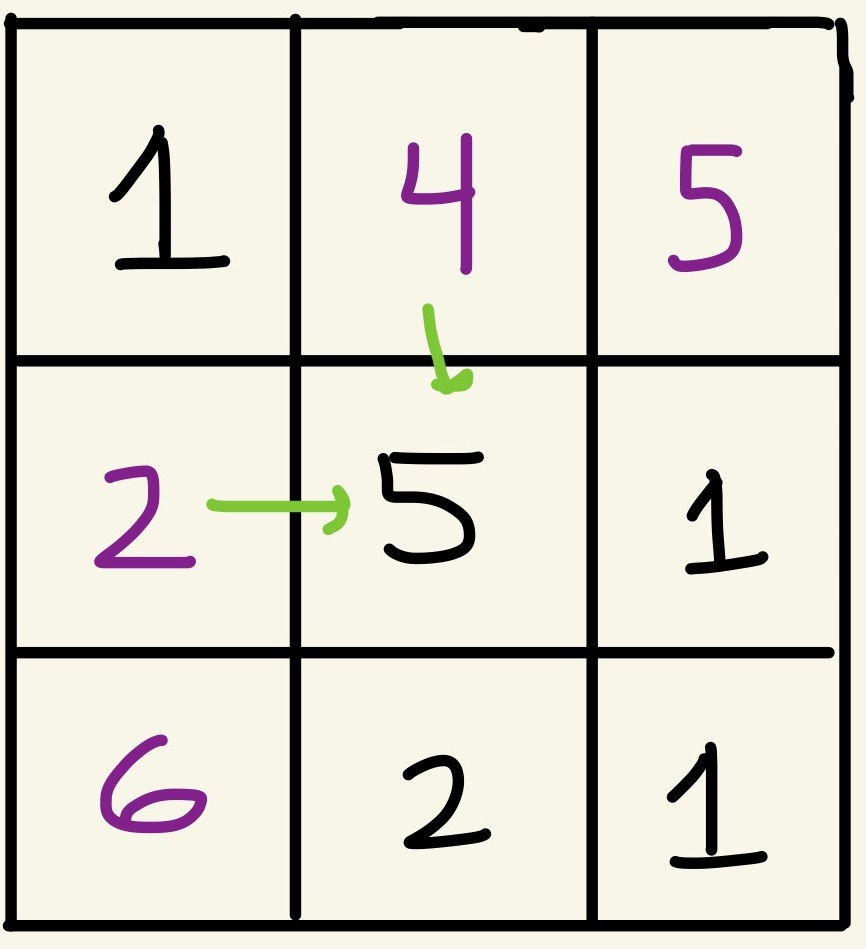
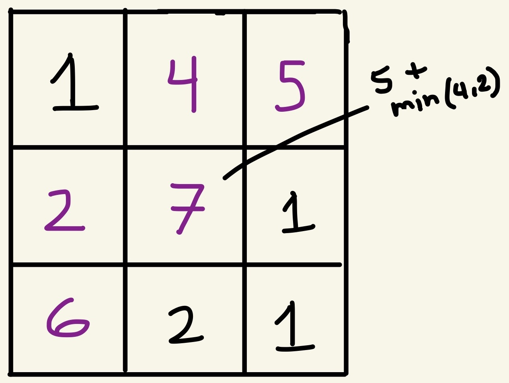
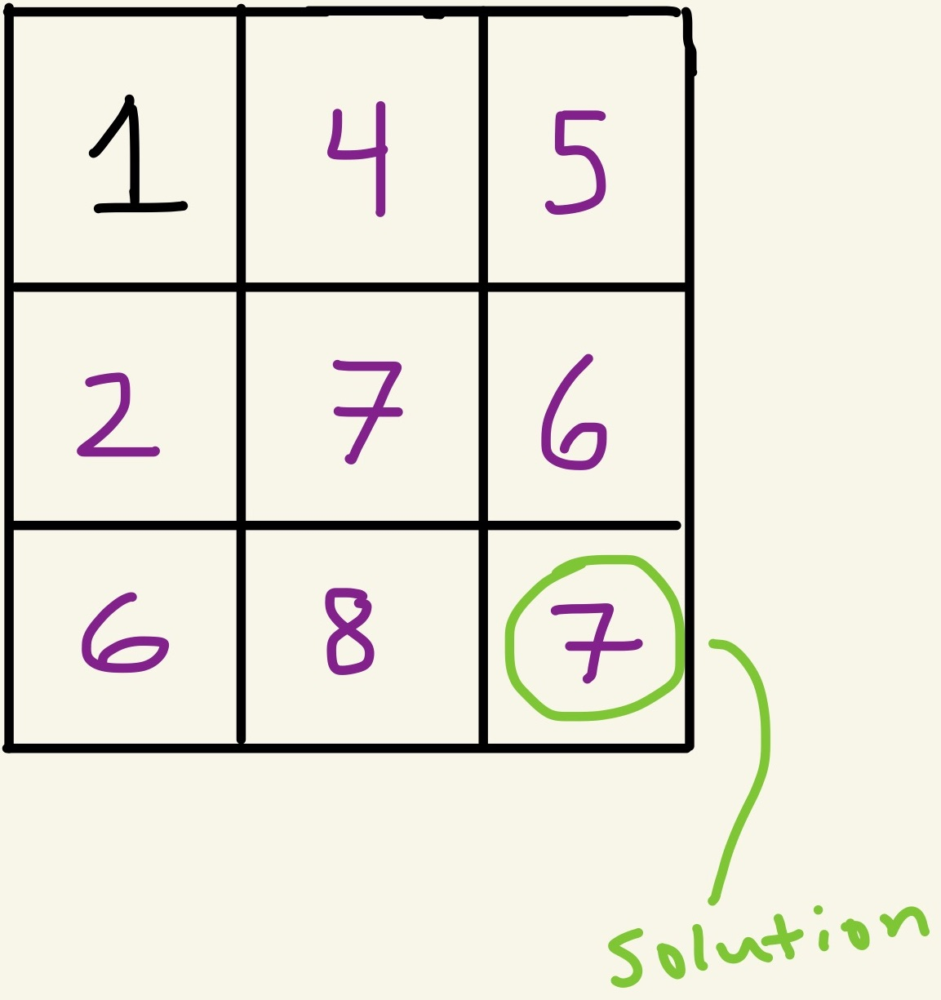

# Minimum Path Sum

Leetcode: https://leetcode.com/problems/minimum-path-sum/

## Problem

Suppose you're given a m x n grid filled with non-negative numbers. Find a path from the top left corner to the bottom right corner where the sum of all numbers along the specific path is minimum.

**Note**: You can only move right or down at any point along the path.

***

### Example

Input:



Output: 7

Explanation: 
The path starting from 1 at the top left corner goes as follows: 1 –> 3 –> 1 –> 1 –> 1

Here's a visual illustration:



***

## Approach

If you've tackled similar problems like this before, this problem looks like a dynamic programming question. For those that aren't familiar with dynamic programming, it's simply a problem solving approach where we use previous calculated answers (memoization) to solve larger problems.

Which makes sense in the context of this problem because we're trying to determine a minimum sum and remember that a sum is merely the result of added sub-sums. 

So, let's start from the top left corner. We have two directions that we can go, we can go down or we can go right.

But what's interesting is that if we notice the first row (`r0`), every element of the first row can only be traversed by a path that comes from its left side.

As well as elements of the first column (`c0`), which can only be reached from the element above.

Here's an illustration:



Now, if we know the cost to reach each element in the first row and column, we'll be able to determine the rest through dynamic programming.

Let's look at what happens when we travel along the first row and first column:



Now that we have everything in place, we can proceed to the other rows and columns. Starting at the second element of the second row, we can enter this path either coming down or going to the right. The way we choose is the minimum of these two choices.

Before:



After:




We simply repeat this process until we reach the bottom left corner. Whatever the value is at the bottom left corner, it is out desired output.

Solution:


***

## Code

```
var minPathSum = function(grid) {
    // go vertical
    for(let i = 1; i < grid.length; i++) {
        grid[i][0] += grid[i-1][0];
    }
    // go horizontal
    for(let j = 1; j < grid[0].length; j++) { 
        grid[0][j] += grid[0][j-1];
    }
    // whole thing
    for(let i = 1; i < grid.length; i++) {
        for(let j = 1; j < grid[0].length; j++) {
            grid[i][j] += Math.min(grid[i-1][j], grid[i][j-1]);
        }
    }
    return grid[grid.length - 1][grid[0].length - 1];
};
```

**Note**: I know it's often discouraged to manipulate the inputs but often it's a question that should be posed to the interview. The reason I'm making this note is because this restriction has consequences on the runtime and space complexity of the solution.

Runtime: `O(mn)`

Space: `O(1)` (the above solution) or `O(mn)` (if you need to copy the grid while leaving the input untouched)